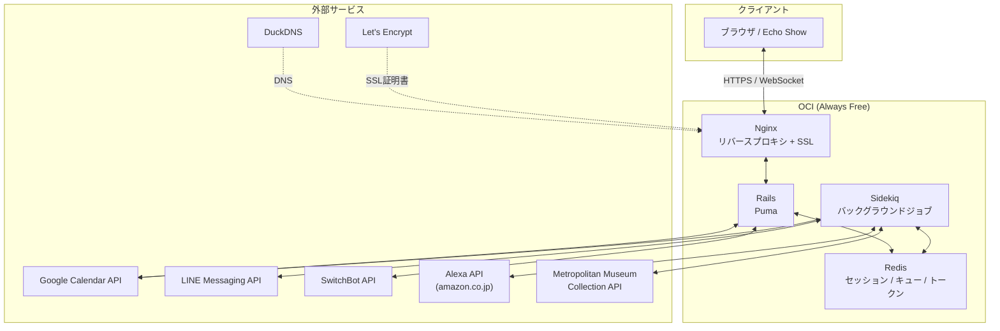
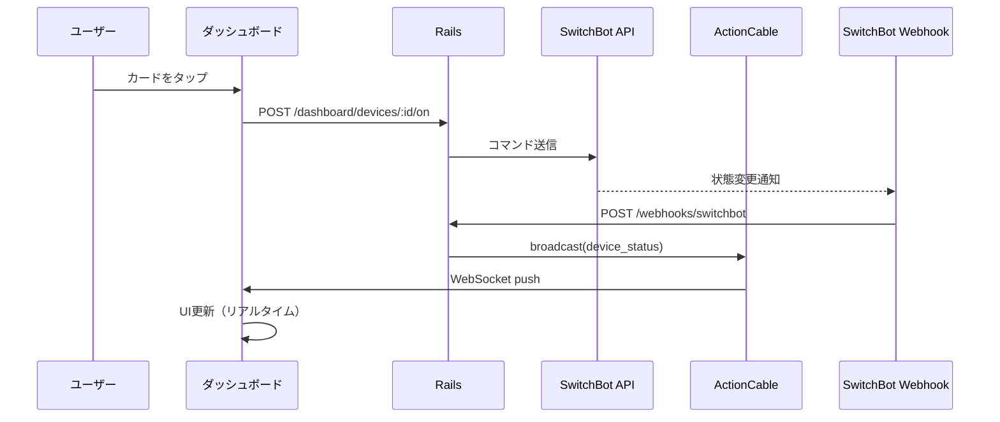
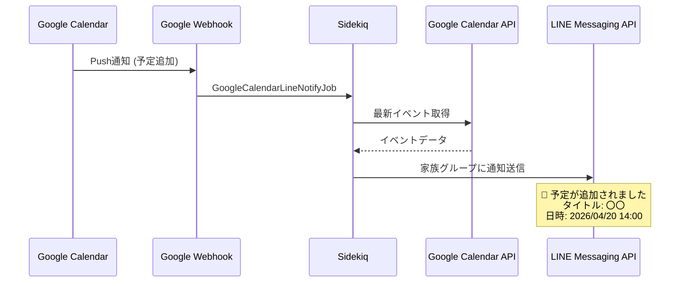
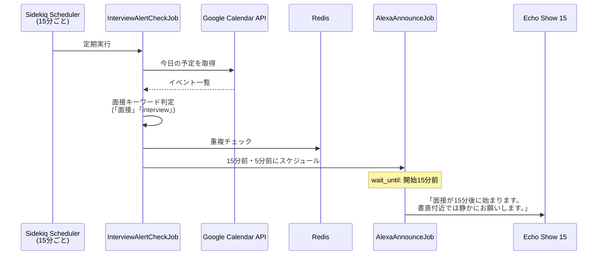
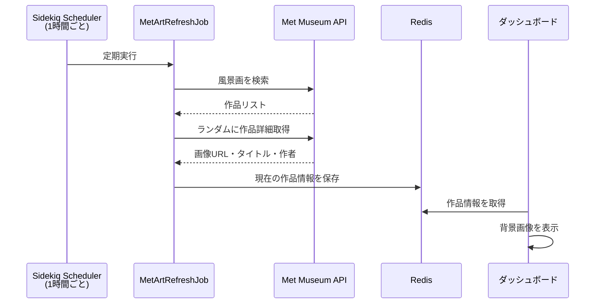

# Home System

自宅の IoT デバイス・クラウドサービスを統合し、家庭内の通知・自動化・デバイス制御を行うシステム。

## 機能一覧

| 機能 | 概要 |
|------|------|
| SwitchBot ダッシュボード | 照明デバイスの状態表示・ON/OFF 操作（リアルタイム同期） |
| Google カレンダー → LINE 通知 | 予定追加時に家族グループ LINE へ自動通知 |
| 面接アラート | カレンダーの面接予定を検知し、Alexa で音声アナウンス |
| メトロポリタン美術館背景 | Met Museum API から絵画を取得し、ダッシュボード背景に表示 |
| カレンダーパネル | 今日・明日の予定をダッシュボード右側に表示 |

## システム構成



## 機能詳細

### SwitchBot ダッシュボード



### Google カレンダー → LINE 通知



### 面接アラート（Alexa アナウンス）



### メトロポリタン美術館背景



## 技術スタック

| カテゴリ | 技術 |
|---------|------|
| バックエンド | Ruby on Rails 8 |
| 非同期処理 | Sidekiq + sidekiq-scheduler |
| リアルタイム通信 | ActionCable (WebSocket) |
| データストア | Redis（DB なし） |
| コンテナ | Docker / Docker Compose |
| リバースプロキシ | Nginx |
| CI/CD | GitHub Actions |
| インフラ | OCI Always Free (AMD 1コア / 1GB) |
| ドメイン | DuckDNS |
| SSL | Let's Encrypt |

## セキュリティ

- Google OAuth 2.0 + Google 2段階認証によるログイン
- 許可メールアドレスのホワイトリスト制御
- 全 Webhook エンドポイントに署名検証（HMAC-SHA256 / secure_compare）
- ActionCable WebSocket 接続に認証必須
- Redis 内のトークン・Cookie は `ActiveSupport::MessageEncryptor` で暗号化
- セッション Cookie に `secure` / `SameSite: Lax` を設定
- ログのパラメータフィルタリング（token, secret, cookie 等）
- HTTPS 強制（Let's Encrypt）

## セットアップ

### 前提条件

- Docker / Docker Compose
- DuckDNS ドメイン
- Let's Encrypt SSL 証明書

### 1. リポジトリのクローン

```bash
git clone https://github.com/syeimee/home-system.git
cd home-system
```

### 2. 環境変数の設定

```bash
cp .env.example .env
# .env を編集して各APIキー・トークンを設定
```

### 3. 起動

```bash
docker compose up -d --build
```

### 4. 初回ログイン

`https://your-domain.duckdns.org/` にアクセスし、Google アカウントでログイン。

### 外部サービスの設定

| サービス | 必要な設定 |
|---------|-----------|
| Google Cloud Console | OAuth クライアント ID / Calendar API 有効化 |
| LINE Developers | Messaging API チャネル / Webhook URL |
| SwitchBot | 開発者向けオプションからトークン取得 |
| Alexa | alexa-cookie-cli で Cookie 取得 → Redis に保存 |

## ライセンス

MIT
